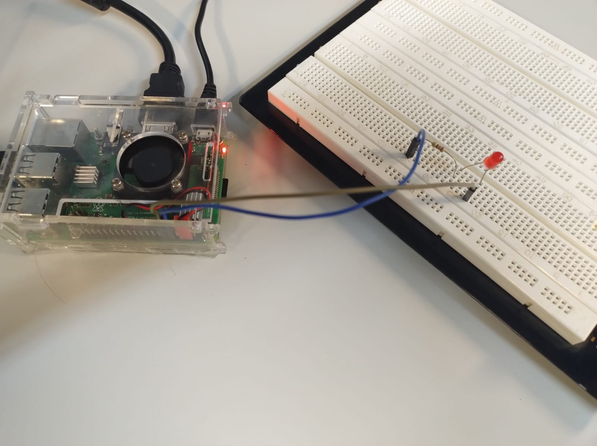

# SEL0337-2025
Primeiro, vamos compreender o systemd. Ele é uma ferramenta que que implementa o estágio "Init System" do boot de inicialização do
sistema.
Ele constitui um conjunto de programas e bibliotecas responsáveis pela sequência correta de inicialização e desligamento do S.O.

Para essa prática, quer-se criar programas de uso de gpio simples e executá-los logo durante a inicialização do sistema (não 
dependendo de acessar o terminal e ativá-los manualmente). Para realizar a prática, primeiro foi redigido o programa "blink.sh". Esse
programa foi redigido em código bash para fins de aprendizado (para tal é preciso inserir uma primeira linha !/bin/bash para 
interpretação de código na linguagem bash). O códgigo "blink.sh" cria um loop infinito para ligar e desligar o led na gpio 18 com 
intervalos de tempo.

Para executar o programa durante a inicialização, é preciso conceder-lhe permissão para tal. Para isso, utiliza-se o comando "chmod"
resonsável por alterar permissões (utilizando "+" adiciona-se a permissão para o "blink.sh").

Para adicionar o programa ao conjunto de programas de inicialização, é preciso criar um novo arquivo do tipo "service", a fim de 
colocá-lo à disposição do systemd. Para isso foi criado o arquivo "Blink.service". Esse programa é responsável por informar o systemd
de todas as informações de serviço necessárias para para que se execute o nosso programa blink (descrições de funcionamento do código
.service comentadas no próprio). 

Uma vez copiando o arquivo "Blink.service" para o diretório padrão de serviços do systemd, ele está a disposição do init system. 
Podemos utilizar o systemctl para testar os programas do init system por meio do systemd, assim podemos verificar se o programa
está funcional. Podemos utilizar "sudo systemctl start blink" e "sudo systemctl stop blink" para isso.

Por fim, para habilitar o programa blink durante a inicialização, precisamos utilizar "sudo systemctl enable blink". Esse "enable"
é responsável por habilitar nosso programa blink para a inicialização, do contrário, ela só executa com "start" no próprio terminal.

Ao executar o "boot" reinicializamos a Rasp para ver o programa sendo executado durante a inicialização do S.O.
Para desabilitar o serviço no "boot", basta utilizar "sudo systemctl disable blink".

Posteriormente, foi utilizado outro código para execução durante a inicialização do sistema (substituindo o blink). Para isso, foi
selecionado um programa para gpio em python criado em práticas anteriores. O programa "pwm_led" altera o nível de pwm do led para 
controlar sua intensidade gradualmente.

Abaixo, segue a imagem do circuito utilizado para ambos os circuitos: 

